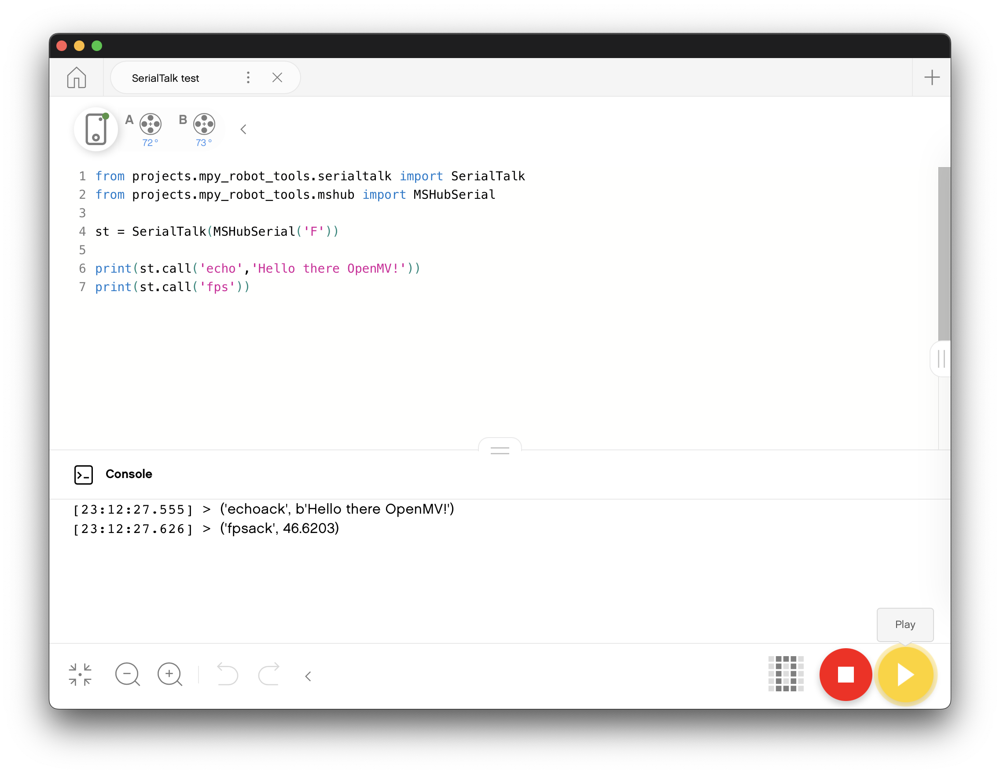

# SerialTalk: platform independent symmetric communication library
## Goal
The goal of the package is to facilitate communication between devices like Robots and peripheral embedded systems or monitors over a serial communication line. Sounds abstract? Think connecting an OpenMV camera to a LEGO SPIKE Prime Robot. Or linking up two pyboards. 

#### SerialTalk version for pybricks primehub using LPF2 protocol

We are devloping a special version of SerialTalk that can be used with the PyBricks PrimeHub firmware using the native Lego serial PF2 communication protocol. See  [SerialTalk_LPF2](https://github.com/antonvh/SerialTalk/tree/master/serialtalk_lpf2)

## Usage
When you want default UART for the platform you're running on, just go:
`from serialtalk.auto import SerialTalk`

When you want special channels like sockets or bluetooth, do it like this:
``` python
from serialtalk import SerialTalk
from serialtalk.sockets import ClientSocketSerial

ser = SerialTalk(ClientSocketSerial("127.0.0.1",8080))
ser.call('echo','read?')
```


## Example with OpenMV H7

1. Copy the complete serialtalk directory to the OpenMV flash (not the whole repo, just the library)
2. Create a main.py with this code. It is an adaptation of the OpenMV Hello world
``` python
import sensor, image, time
from serialtalk.auto import SerialTalk

sensor.reset()                      # Reset and initialize the sensor.
sensor.set_pixformat(sensor.RGB565) # Set pixel format to RGB565 (or GRAYSCALE)
sensor.set_framesize(sensor.QVGA)   # Set frame size to QVGA (320x240)
sensor.skip_frames(time = 2000)     # Wait for settings take effect.
clock = time.clock()                # Create a clock object to track the FPS.

st = SerialTalk()                   # Create UART comm object
def fps():                          # Create function to call from uart
    return clock.fps()
st.add_command(fps,"repr")          # Add function to callable uart commands

while(True):
    clock.tick()                    # Update the FPS clock.
    img = sensor.snapshot()         # Take a picture and return the image.
    st.process_uart()               # Process aurt calls
    print(clock.fps())              # Note: OpenMV Cam runs about half as fast when connected
                                    # to the IDE. The FPS should increase once disconnected.
```
3. On the SPIKE Prime [Install mpy-robot-tools](https://github.com/antonvh/mpy-robot-tools/blob/master/Installer/install_mpy_robot_tools.py) with the installer script. Note that the installer may seem unresponsive. Just have some patience.
4. Run this script on SPIKE Prime:
``` python
from projects.mpy_robot_tools.serialtalk import SerialTalk
from projects.mpy_robot_tools.mshub import MSHubSerial

st = SerialTalk(MSHubSerial('F'))

print(st.call('echo','Hello there OpenMV!'))
print(st.call('fps'))
```
This should be the result:



## Roadmap, todo
- test on esp8266 platform
- test on bt comm channels
- create pyserial/desktop channels 
