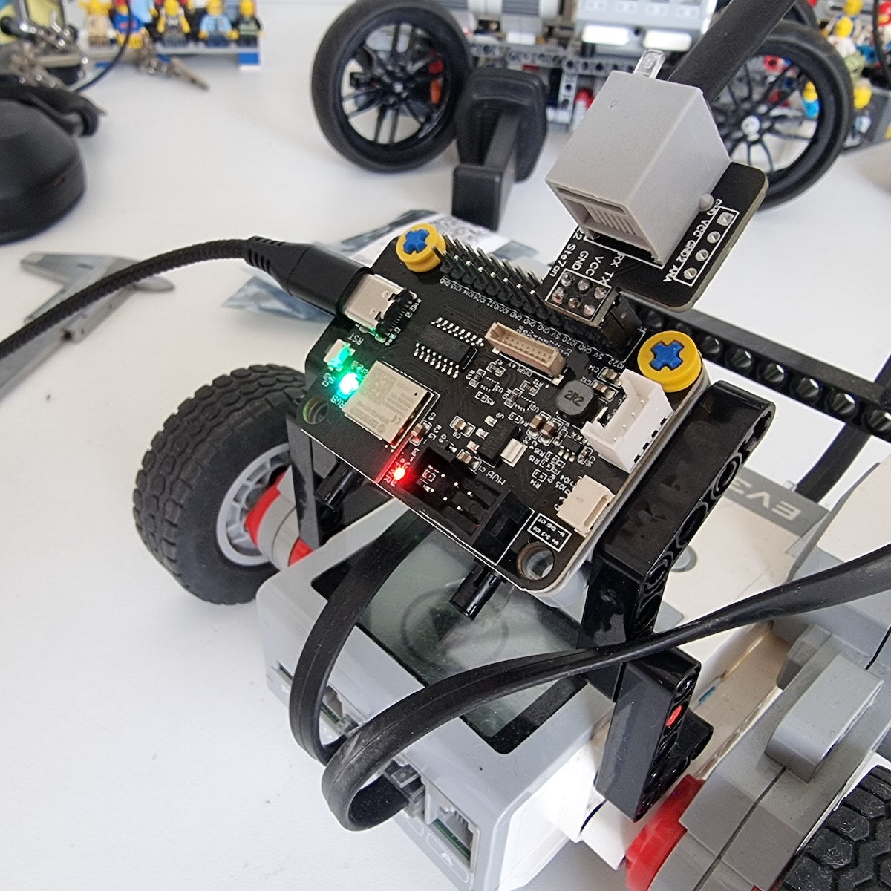

# SerialTalk example with LMS-ESP32v2.0

In this example I connected the LMS-ESP32v2.0 (the one with USB-C) to EV3 with the adapter board. Take care to point that board **outward** so that RX is connected to pin 21 and tx to pin 22! 

Copy main.py over to the lms-esp32 with thonny or another tool.

Use the MINDSTORMS EV3 MicroPython VS Code extension to open the folder [say_hello](say_hello) and press F5 (Run and debug) to run the code on EV3

Here' a picture of you should connect the board.

## Warning
If you flip the board inward, like it was on the LMS-ESP32v1.0 YOU WILL DESTROY YOUR LMS-ESP32 board. Don't do it.