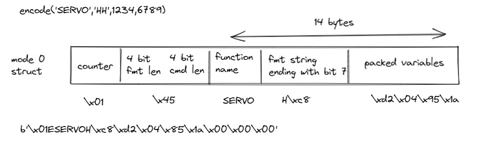

# SerialTalk for LPF2

Initial code running on LMS-ESP32 and pybricks (primehub) for showing a proof of concept of bi-directional SerialTalk over the standard LPF2 serial detector protocol.

The library is losely based on the generic SerialTalk library. Because we do not use a serial device having `read`, `write` and `available` methods, we had to adopt the way messages are being received and send ovder the LPF2 connection.
## LMS-ESP32
The LMS-ESP32 emulates a Lego Detector. It creates a mode which allows to receive and send 16 unsigned bytes. Some appilications on the LMS-ESP32 need 5V power through the buck converter. The nuck convertor is powered by the M+ motor pin. This can be accomplished by extending the mode name accoriding to mode [flags](https://github.com/pybricks/technical-info/blob/master/uart-protocol.md#info_name). We use the `requires constant power on pin 2` flag which is bit 7 of the first byte. The so called motor infor field is 6 bytes long. The name of the mode becomes: `"POWER\x00\80\x00\x00\x00\x00\x00"`, where a zero byte is inserted between the name and the motot description. This feauture only works when the sensor is detected as a motor by the pybricks hub. Therefore, we use exactly the same modes as in a real small motor:
```
name="POWER\x00\80\x00\x00\x00\x00\x00"
mode_0 = [name,[16,LPF2.DATA8,1,0],[-100,100],[-100,100],[-100,100],'PCT',[LPF2.ABSOLUTE,LPF2.ABSOLUTE],True]
mode_1 = ['SPEED',[1,LPF2.DATA8,4,0],[-100,100],[-100,100],[-100,100],'PCT',[LPF2.ABSOLUTE,LPF2.ABSOLUTE],True]
mode_2 = ['POS',[1,LPF2.DATA32,4,0],[-360,360],[-100,100],[-360,360],'DEG',[LPF2.RELATIVE,LPF2.RELATIVE],True]
mode_3 = ['APOS',[1,LPF2.DATA16,3,0],[-180,179],[-200,200],[-180,179],'DEG',[LPF2.RELATIVE,LPF2.RELATIVE],True]
mode_4 = ['LOAD',[1,LPF2.DATA8,3,0],[0,127],[0,100],[0,127],'PCT',[LPF2.RELATIVE,LPF2.RELATIVE],False]
```
where mode_0 has a dataset of 16 DATA8 bytes in both direction (map_in and map_out is LPF2.ABSOLUTE).
Now, we can measure approximately 7 or 8V on the M+ output.

## PyBricks
On the pybricks, the same serialtalk_lpf2 library is running. Here we use the `PUPDevice` class with its `read` and `write` methods to receve and send 16 bytes chuncks from and to the LMS-ESP32.

## Files

`serialtalk_lpf2.py` is the library that runs both on the LMS-ESP32 as well as the PyBricks PrimeHub. On the primehub you have to paste the code of this library (select raw mode) in the editor of PyBricks and append the example code below it. On the ESP32 yoy have to upload this library to the root of the flash filesystem tohether with the `LPF2_ESP32.py` library which is for emulating a native Lego LPF2 sensor.


## Protocol

Because of the nature of LPF2 communication the SerialTalk protoocl runnig on top of LPF2 is also asymmetrical. The LMS-ESP32 acts a the slave (like a lego sensor). Calls can be initiated from the primehub side. A call towards the LMS-ESP32 will inititae a call back function asynchrounously on the LMS-ESP32. In that call back function, the command is processed, executed and the respons is send back to the primehub.
The primehub does not get any interrupt when a packet is arrived ftom the LMS-ESP32. By polling the received messages, it can see by an increase of the counter field, that a new packet has arrived.

### Packet layout
Because we only have 16 bytes at our disposal, we compressed the SerialTalk protocol further. The following restrictions apply:
we support raw packing and packing using a format string similar to struct.pack
- the total bytes of a single command, format string and packed variables cannot exceed 15 bytes
- on the LMS-ESP32 a call back function will be called when receiving a command from the hub
- on the hub, the commands received from the LMS-ESP32 should be polled. A counter is used to see whether the received message is updated
- because the LMS-ESP32 simulated an LPF2 sensor, it must continuously update the sensor data; consequently, it runs an endless loop

The basic layout of a packet a command string`cmd`, a `format` string and the packed variabled.
The following fields can be distinguided:
- a single byte counter field which increases by 1 every command that is send
- a single byte combined length field with the lower 4 bits for the command length and the upper 4 bits for the format string length
- a format string field where the ending of the formatfield is indicated by setting bit 7 of the last posision
- the packed variables field with packing according to the format string field.
- padding with `\x00` to a total length of 16.
- 

